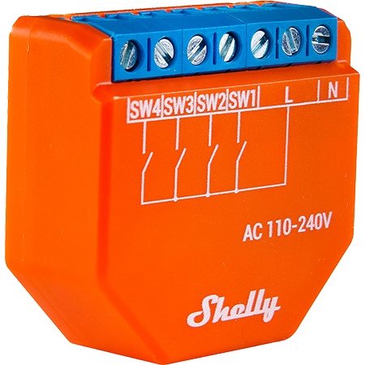

# ESPHome [](https://discord.gg/KhAMKrd) [](https://GitHub.com/esphome/esphome/releases/)

[](https://esphome.io/)

# esphome-configs

A collection of my personal [ESPHome](https://esphome.io) configs and packages.

## Config Groups

- [Common](#common)
- [Device Specific Config](#device-specific-config)
- [MQTT](#mqtt)
- [MQTT Automation](#mqtt-automation)
- [Sensor](#sensor)
- [Text Sensor](#text-sensor)
- [Switch](#switch)
- [Binary Sensor](#binary-sensor)

## Device Groups

- [Athom 5W GU10](#athom-5w-gu10)
- [MiBoxer WB5](#miboxer-wb5)
- [Lusunt 36W Ceiling Light](#lusunt-36w-ceiling-light)
- [OffDarks 68W Ceiling Light](#offdarks-68w-ceiling-light)
- [Offdarks 28W Ceiling Light](#offdarks-28w-ceiling-light)
- [Lumary 18W Recessed Panel Light](#lumary-18w-recessed-panel-light)
- [Iralan 42W Ceiling Light ESP32-C3](#iralan-42w-ceiling-light-esp32-c3)
- [Iralan 42W Ceiling Light ESP32-S2](#iralan-42w-ceiling-light-esp32-s2)
- [MiBoxer FUT035W](#miboxer-fut035w)
- [MiBoxer FUT039W](#miboxer-fut039w)
- [Shelly 1](#shelly-1)
- [Shelly 2.5](#shelly-25)
- [Shelly Plus i4](#shelly-plus-i4)

# Common

[`.base-debug.yaml`](.base-debug.yaml)

This is the common config is present in all configs. It includes:

- Logger
- OTA with password
- Secret-based Wifi configuration
- Fallback AP with secret password

# Device Specific Config

`.base.devicetype-\*.yaml`

This is a device specific config that will compile correctly for the esp chip used with that device, includes the following:

- ESPHome Template, name, comment platform, board project name and version\*, any platformio options including any special platform packages and framework version and platform version
- Captive Portal
- Web Server for Web API
- Globals required by the device
- Output pins defined
- Components like Tuya, Light, WLED, E1.31
- External Components like PR for ledc when using ESP32-C3 with arduino framework
- UART pins if needed by TuyaMCU
- i2c needed by some Shelly devices
- device specific switches\*\*

\*this will vary by device and helps to show correct data in Home Assistant and ensure firmware compiles correctly. Name, Comment, Project Name and Project Version values are definable in substitutions.

\*\*be sure not to include .base.switch\*.yaml files as esphome will complain duplicate switch: has been defined.

# MQTT

[`.base.mqtt-common.yaml`](.base.mqtt-common.yaml)

This is the mqtt broker connection config is present in most configs. It includes:

- MQTT Broker Hostname/IP in `secrets.yaml`
- MQTT Username in `secrets.yaml`
- MQTT Password in `secrets.yaml`
- Discovery to allow Home Assistant to setup device\*\*\*

\*\*\*MQTT Discovery helps to ensure messages are picked up correctly but results in duplicate devices, I have kept this enabled but manually disable the device in Home Assistant cleaning up and double numbering ensuring the MQTT device has \*_2 entity id and has been disabled

# MQTT Automation

.base.mqtt-\*-automation-\*.yaml

This is a fallback mechanism in case Home Assistant becomes Offline. It mainly caters for Shelly Plus i4 and includes:

- Short Click
- Hold
- Double Click

Supports 4 buttons and multiple devices depending on .base.mqtt-\*-automation-\*.yaml file chosen

Device topics are templated in substitutions

# Sensor

[`.base.sensor-common.yaml`](.base.sensor-common.yaml)

Sensors in Home Assistant. It includes:

- WiFi Signal
- Uptime

[`.base.sensor-common-die-temp.yaml`](.base.sensor-common-die-temp.yaml)

Includes the above plus:

- ESP32 Variants CPU Temperature

# Text Sensor

[`.base.text-sensor-common.yaml`](.base.text-sensor-common.yaml)

This is the text sensor common config is present in all configs. It includes:

- IP
- SSID
- BSSID
- Human Readable Uptime

# Switch

[`.base.text-sensor-common.yaml`](.base.text-sensor-common.yaml)

This is the common switch config is present in all configs. It includes:

- Restart Switch
- Restart Switch (Safe Mode)

# Binary Sensor

[`.base.binary-sensor-common.yaml`](.base.binary-sensor-common.yaml)

This is the binary sensor common config is present in all configs. It includes:

- Status

## Setup

1. Copy the required .\*.yaml into your local ESPHome directory.
1. Open `secrets.yaml` and enter your Wifi connection info.
1. Ensure there ar no duplicate sections like double switch sections via the use of include, validate all configs before building to troubleshoot. 

# Athom 5W GU10

[`.base.bulb.athom-gu10.yaml`](.base.bulb.athom-gu10.yaml)

[](https://www.athom.tech/blank-1/esphome-gu10-rgbcw)<br />

[Athom GU10 RGBCW for ESPHome](https://www.athom.tech/blank-1/esphome-gu10-rgbcw)\
[AliExpress](https://www.aliexpress.com/item/1005003124769590.html)\
[ESPHome Devices Page](https://www.esphome-devices.com/devices/Athom-GU10-Bulb)

these bulbs come with either tasmota or esphome installed

device comes from factory setup with initial setup Captive Portal and an ESPHome adopt url setup in the default config

# Setup

the following files are required and all following substitutions should be set: - name, ssid, description, friendly name, projectname and project version
see [`bulb.ashish-spot1.yaml`](bulb.ashish-spot1.yaml) for example

`.base-debug.yaml`\
`.base.bulb.athom-gu10.yaml`\
`.base.sensor-common.yaml`\
`.base.text-sensor-common.yaml`\
`.base.switch-common.yaml`\
`.base.binary-sensor-common.yaml`

optional\
`.base.mqtt-light-automation-4-button-rgbcct.yaml` - if controlled by a Shelly Plus i4

I have split the CT & RGB Channels to avoid overloading the bulb however that should not be an issue, and it is a personal preference

This device incorporates the following features in addition to MQTT, MQTT Automation, Sensors, Text Sensors, Restart Switches & Binary Status Sensor:

- ESP8285 based 2MB Flash
- Captive Portal
- Web Server
- WLED
- E1.31
- DDP

# MiBoxer WB5

[`.base.switch.shelly-plus-i4-arduino.yaml`](.base.switch.shelly-plus-i4-arduino.yaml)

[](https://www.athom.tech/blank-1/esphome-gu10-rgbcw)<br />

[Athom GU10 RGBCW for ESPHome](https://www.athom.tech/blank-1/esphome-gu10-rgbcw)\
[AliExpress](https://www.aliexpress.com/item/1005003124769590.html)\
[ESPHome Devices Page](https://www.esphome-devices.com/devices/Athom-GU10-Bulb)

# Setup

the following files are required and all following substitutions should be set: - name, ssid, description, friendly name, projectname and project version
see bulb.ashish-spot1.yaml for example

[`.base-debug.yaml`](.base-debug.yaml)\
[`.base.switch.shelly-plus-i4-arduino.yaml]`(.base.switch.shelly-plus-i4-arduino.yaml)\
[`.base.mqtt-light-automation-4-button-rgbcct.yaml`](.base.mqtt-light-automation-4-button-rgbcct.yaml) - if contreolled by a Shelly Plus i4\\
[`.base.sensor-common-die-temp.yaml`](.base.sensor-common-die-temp.yaml)\
[`.base.text-sensor-common.yaml`](.base.text-sensor-common.yaml)\
[`.base.switch-common.yaml`](.base.switch-common.yaml)\
[`.base.binary-sensor-common.yaml`](.base.binary-common.yaml)

Optional\
.base.mqtt-light-automation-4-button-rgbcct.yaml - if contreolled by a Shelly Plus i4

I have split the CT & RGB Channels to avoid overloading the bulb however that should not be an issue, and is a personal preference

This device incorporates the following features in addition to MQTT, MQTT Automation, Sensors, Text Sensors, Restart Switches & Binary Status Sensor:

- ESP8285 based 2MB Flash
- Captive Portal
- Web Server
- WLED
- E1.31
- DDP

# Lusunt 36W Ceiling Light

[`.base.switch.shelly-plus-i4-arduino.yaml`](.base.switch.shelly-plus-i4-arduino.yaml)

[](https://www.athom.tech/blank-1/esphome-gu10-rgbcw)<br />

[Athom GU10 RGBCW for ESPHome](https://www.athom.tech/blank-1/esphome-gu10-rgbcw)\
[AliExpress](https://www.aliexpress.com/item/1005003124769590.html)\
[ESPHome Devices Page](https://www.esphome-devices.com/devices/Athom-GU10-Bulb)

# Setup

the following files are required and all following substitutions should be set: - name, ssid, description, friendly name, projectname and project version
see bulb.ashish-spot1.yaml for example

[`.base-debug.yaml`](.base-debug.yaml)\
[`.base.switch.shelly-plus-i4-arduino.yaml]`(.base.switch.shelly-plus-i4-arduino.yaml)\
[`.base.mqtt-light-automation-4-button-rgbcct.yaml`](.base.mqtt-light-automation-4-button-rgbcct.yaml) - if contreolled by a Shelly Plus i4\\
[`.base.sensor-common-die-temp.yaml`](.base.sensor-common-die-temp.yaml)\
[`.base.text-sensor-common.yaml`](.base.text-sensor-common.yaml)\
[`.base.switch-common.yaml`](.base.switch-common.yaml)\
[`.base.binary-sensor-common.yaml`](.base.binary-common.yaml)

I have split the CT & RGB Channels to avoid overloading the bulb however that should not be an issue, and is a personal preference

This device incorporates the following features in addition to MQTT, MQTT Automation, Sensors, Text Sensors, Restart Switches & Binary Status Sensor:

- ESP8285 based 2MB Flash
- Captive Portal
- Web Server
- WLED
- E1.31
- DDP 

# OffDarks 68W Ceiling Light

[`.base.switch.shelly-plus-i4-arduino.yaml`](.base.switch.shelly-plus-i4-arduino.yaml)

[](https://www.athom.tech/blank-1/esphome-gu10-rgbcw)<br />

[Athom GU10 RGBCW for ESPHome](https://www.athom.tech/blank-1/esphome-gu10-rgbcw)\
[AliExpress](https://www.aliexpress.com/item/1005003124769590.html)\
[ESPHome Devices Page](https://www.esphome-devices.com/devices/Athom-GU10-Bulb)

# Setup

the following files are required and all following substitutions should be set: - name, ssid, description, friendly name, projectname and project version
see bulb.ashish-spot1.yaml for example

[`.base-debug.yaml`](.base-debug.yaml)\
[`.base.switch.shelly-plus-i4-arduino.yaml]`(.base.switch.shelly-plus-i4-arduino.yaml)\
[`.base.mqtt-light-automation-4-button-rgbcct.yaml`](.base.mqtt-light-automation-4-button-rgbcct.yaml) - if contreolled by a Shelly Plus i4\\
[`.base.sensor-common-die-temp.yaml`](.base.sensor-common-die-temp.yaml)\
[`.base.text-sensor-common.yaml`](.base.text-sensor-common.yaml)\
[`.base.switch-common.yaml`](.base.switch-common.yaml)\
[`.base.binary-sensor-common.yaml`](.base.binary-common.yaml)

I have split the CT & RGB Channels to avoid overloading the bulb however that should not be an issue, and is a personal preference

This device incorporates the following features in addition to MQTT, MQTT Automation, Sensors, Text Sensors, Restart Switches & Binary Status Sensor:

- ESP8285 based 2MB Flash
- Captive Portal
- Web Server
- WLED
- E1.31
- DDP 

# Lumary 18W Recessed Panel Light

[`.base.switch.shelly-plus-i4-arduino.yaml`](.base.switch.shelly-plus-i4-arduino.yaml)

[](https://www.athom.tech/blank-1/esphome-gu10-rgbcw)<br />

[Athom GU10 RGBCW for ESPHome](https://www.athom.tech/blank-1/esphome-gu10-rgbcw)\
[AliExpress](https://www.aliexpress.com/item/1005003124769590.html)\
[ESPHome Devices Page](https://www.esphome-devices.com/devices/Athom-GU10-Bulb)

# Setup

the following files are required and all following substitutions should be set: - name, ssid, description, friendly name, projectname and project version
see bulb.ashish-spot1.yaml for example

[`.base-debug.yaml`](.base-debug.yaml)\
[`.base.switch.shelly-plus-i4-arduino.yaml]`(.base.switch.shelly-plus-i4-arduino.yaml)\
[`.base.mqtt-light-automation-4-button-rgbcct.yaml`](.base.mqtt-light-automation-4-button-rgbcct.yaml) - if contreolled by a Shelly Plus i4\\
[`.base.sensor-common-die-temp.yaml`](.base.sensor-common-die-temp.yaml)\
[`.base.text-sensor-common.yaml`](.base.text-sensor-common.yaml)\
[`.base.switch-common.yaml`](.base.switch-common.yaml)\
[`.base.binary-sensor-common.yaml`](.base.binary-common.yaml)

I have split the CT & RGB Channels to avoid overloading the bulb however that should not be an issue, and is a personal preference

This device incorporates the following features in addition to MQTT, MQTT Automation, Sensors, Text Sensors, Restart Switches & Binary Status Sensor:

- ESP8285 based 2MB Flash
- Captive Portal
- Web Server
- WLED
- E1.31
- DDP 

# Iralan 42W Ceiling Light ESP32-C3

[`.base.switch.shelly-plus-i4-arduino.yaml`](.base.switch.shelly-plus-i4-arduino.yaml)

[](https://www.athom.tech/blank-1/esphome-gu10-rgbcw)<br />

[Athom GU10 RGBCW for ESPHome](https://www.athom.tech/blank-1/esphome-gu10-rgbcw)\
[AliExpress](https://www.aliexpress.com/item/1005003124769590.html)\
[ESPHome Devices Page](https://www.esphome-devices.com/devices/Athom-GU10-Bulb)

# Setup

the following files are required and all following substitutions should be set: - name, ssid, description, friendly name, projectname and project version
see bulb.ashish-spot1.yaml for example

[`.base-debug.yaml`](.base-debug.yaml)\
[`.base.switch.shelly-plus-i4-arduino.yaml]`(.base.switch.shelly-plus-i4-arduino.yaml)\
[`.base.mqtt-light-automation-4-button-rgbcct.yaml`](.base.mqtt-light-automation-4-button-rgbcct.yaml) - if contreolled by a Shelly Plus i4\\
[`.base.sensor-common-die-temp.yaml`](.base.sensor-common-die-temp.yaml)\
[`.base.text-sensor-common.yaml`](.base.text-sensor-common.yaml)\
[`.base.switch-common.yaml`](.base.switch-common.yaml)\
[`.base.binary-sensor-common.yaml`](.base.binary-common.yaml)

I have split the CT & RGB Channels to avoid overloading the bulb however that should not be an issue, and is a personal preference

This device incorporates the following features in addition to MQTT, MQTT Automation, Sensors, Text Sensors, Restart Switches & Binary Status Sensor:

- ESP8285 based 2MB Flash
- Captive Portal
- Web Server
- WLED
- E1.31
- DDP 

# Iralan 42W Ceiling Light ESP32-S2

[`.base.switch.shelly-plus-i4-arduino.yaml`](.base.switch.shelly-plus-i4-arduino.yaml)

[](https://www.athom.tech/blank-1/esphome-gu10-rgbcw)<br />

[Athom GU10 RGBCW for ESPHome](https://www.athom.tech/blank-1/esphome-gu10-rgbcw)\
[AliExpress](https://www.aliexpress.com/item/1005003124769590.html)\
[ESPHome Devices Page](https://www.esphome-devices.com/devices/Athom-GU10-Bulb)

# Setup

the following files are required and all following substitutions should be set: - name, ssid, description, friendly name, projectname and project version
see bulb.ashish-spot1.yaml for example

[`.base-debug.yaml`](.base-debug.yaml)\
[`.base.switch.shelly-plus-i4-arduino.yaml]`(.base.switch.shelly-plus-i4-arduino.yaml)\
[`.base.mqtt-light-automation-4-button-rgbcct.yaml`](.base.mqtt-light-automation-4-button-rgbcct.yaml) - if contreolled by a Shelly Plus i4\\
[`.base.sensor-common-die-temp.yaml`](.base.sensor-common-die-temp.yaml)\
[`.base.text-sensor-common.yaml`](.base.text-sensor-common.yaml)\
[`.base.switch-common.yaml`](.base.switch-common.yaml)\
[`.base.binary-sensor-common.yaml`](.base.binary-common.yaml)

I have split the CT & RGB Channels to avoid overloading the bulb however that should not be an issue, and is a personal preference

This device incorporates the following features in addition to MQTT, MQTT Automation, Sensors, Text Sensors, Restart Switches & Binary Status Sensor:

- ESP8285 based 2MB Flash
- Captive Portal
- Web Server
- WLED
- E1.31
- DDP 

# MiBoxer FUT035W

[`.base.switch.shelly-plus-i4-arduino.yaml`](.base.switch.shelly-plus-i4-arduino.yaml)

[](https://www.athom.tech/blank-1/esphome-gu10-rgbcw)<br />

[Athom GU10 RGBCW for ESPHome](https://www.athom.tech/blank-1/esphome-gu10-rgbcw)\
[AliExpress](https://www.aliexpress.com/item/1005003124769590.html)\
[ESPHome Devices Page](https://www.esphome-devices.com/devices/Athom-GU10-Bulb)

# Setup

the following files are required and all following substitutions should be set: - name, ssid, description, friendly name, projectname and project version
see bulb.ashish-spot1.yaml for example

[`.base-debug.yaml`](.base-debug.yaml)\
[`.base.switch.shelly-plus-i4-arduino.yaml]`(.base.switch.shelly-plus-i4-arduino.yaml)\
[`.base.mqtt-light-automation-4-button-rgbcct.yaml`](.base.mqtt-light-automation-4-button-rgbcct.yaml) - if contreolled by a Shelly Plus i4\\
[`.base.sensor-common-die-temp.yaml`](.base.sensor-common-die-temp.yaml)\
[`.base.text-sensor-common.yaml`](.base.text-sensor-common.yaml)\
[`.base.switch-common.yaml`](.base.switch-common.yaml)\
[`.base.binary-sensor-common.yaml`](.base.binary-common.yaml)

I have split the CT & RGB Channels to avoid overloading the bulb however that should not be an issue, and is a personal preference

This device incorporates the following features in addition to MQTT, MQTT Automation, Sensors, Text Sensors, Restart Switches & Binary Status Sensor:

- ESP8285 based 2MB Flash
- Captive Portal
- Web Server
- WLED
- E1.31
- DDP 

# MiBoxer FUT039W

[`.base.switch.shelly-plus-i4-arduino.yaml`](.base.switch.shelly-plus-i4-arduino.yaml)

[](https://www.athom.tech/blank-1/esphome-gu10-rgbcw)<br />

[Athom GU10 RGBCW for ESPHome](https://www.athom.tech/blank-1/esphome-gu10-rgbcw)\
[AliExpress](https://www.aliexpress.com/item/1005003124769590.html)\
[ESPHome Devices Page](https://www.esphome-devices.com/devices/Athom-GU10-Bulb)

# Setup

the following files are required and all following substitutions should be set: - name, ssid, description, friendly name, projectname and project version
see bulb.ashish-spot1.yaml for example

[`.base-debug.yaml`](.base-debug.yaml)\
[`.base.switch.shelly-plus-i4-arduino.yaml]`(.base.switch.shelly-plus-i4-arduino.yaml)\
[`.base.mqtt-light-automation-4-button-rgbcct.yaml`](.base.mqtt-light-automation-4-button-rgbcct.yaml) - if contreolled by a Shelly Plus i4\\
[`.base.sensor-common-die-temp.yaml`](.base.sensor-common-die-temp.yaml)\
[`.base.text-sensor-common.yaml`](.base.text-sensor-common.yaml)\
[`.base.switch-common.yaml`](.base.switch-common.yaml)\
[`.base.binary-sensor-common.yaml`](.base.binary-common.yaml)

I have split the CT & RGB Channels to avoid overloading the bulb however that should not be an issue, and is a personal preference

This device incorporates the following features in addition to MQTT, MQTT Automation, Sensors, Text Sensors, Restart Switches & Binary Status Sensor:

- ESP8285 based 2MB Flash
- Captive Portal
- Web Server
- WLED
- E1.31
- DDP 

# Offdarks 28W Ceiling Light

[`.base.switch.shelly-plus-i4-arduino.yaml`](.base.switch.shelly-plus-i4-arduino.yaml)

[](https://www.athom.tech/blank-1/esphome-gu10-rgbcw)<br />

# Setup

[Athom GU10 RGBCW for ESPHome](https://www.athom.tech/blank-1/esphome-gu10-rgbcw)\
[AliExpress](https://www.aliexpress.com/item/1005003124769590.html)\
[ESPHome Devices Page](https://www.esphome-devices.com/devices/Athom-GU10-Bulb)

the following files are required and all following substitutions should be set: - name, ssid, description, friendly name, projectname and project version
see bulb.ashish-spot1.yaml for example

[`.base-debug.yaml`](.base-debug.yaml)\
[`.base.switch.shelly-plus-i4-arduino.yaml]`(.base.switch.shelly-plus-i4-arduino.yaml)\
[`.base.mqtt-light-automation-4-button-rgbcct.yaml`](.base.mqtt-light-automation-4-button-rgbcct.yaml) - if contreolled by a Shelly Plus i4\\
[`.base.sensor-common-die-temp.yaml`](.base.sensor-common-die-temp.yaml)\
[`.base.text-sensor-common.yaml`](.base.text-sensor-common.yaml)\
[`.base.switch-common.yaml`](.base.switch-common.yaml)\
[`.base.binary-sensor-common.yaml`](.base.binary-common.yaml)

I have split the CT & RGB Channels to avoid overloading the bulb however that should not be an issue, and is a personal preference

This device incorporates the following features in addition to MQTT, MQTT Automation, Sensors, Text Sensors, Restart Switches & Binary Status Sensor:

- ESP8285 based 2MB Flash
- Captive Portal
- Web Server
- WLED
- E1.31
- DDP 

# Shelly 1

[`.base.switch.shelly-plus-i4-arduino.yaml`](.base.switch.shelly-plus-i4-arduino.yaml)

[](https://www.athom.tech/blank-1/esphome-gu10-rgbcw)<br />

[Athom GU10 RGBCW for ESPHome](https://www.athom.tech/blank-1/esphome-gu10-rgbcw)\
[AliExpress](https://www.aliexpress.com/item/1005003124769590.html)\
[ESPHome Devices Page](https://www.esphome-devices.com/devices/Athom-GU10-Bulb)

# Setup

the following files are required and all following substitutions should be set: - name, ssid, description, friendly name, projectname and project version
see bulb.ashish-spot1.yaml for example

[`.base-debug.yaml`](.base-debug.yaml)\
[`.base.switch.shelly-plus-i4-arduino.yaml]`(.base.switch.shelly-plus-i4-arduino.yaml)\
[`.base.mqtt-light-automation-4-button-rgbcct.yaml`](.base.mqtt-light-automation-4-button-rgbcct.yaml) - if contreolled by a Shelly Plus i4\\
[`.base.sensor-common-die-temp.yaml`](.base.sensor-common-die-temp.yaml)\
[`.base.text-sensor-common.yaml`](.base.text-sensor-common.yaml)\
[`.base.switch-common.yaml`](.base.switch-common.yaml)\
[`.base.binary-sensor-common.yaml`](.base.binary-common.yaml)

I have split the CT & RGB Channels to avoid overloading the bulb however that should not be an issue, and is a personal preference

This device incorporates the following features in addition to MQTT, MQTT Automation, Sensors, Text Sensors, Restart Switches & Binary Status Sensor:

- ESP8285 based 2MB Flash
- Captive Portal
- Web Server
- WLED
- E1.31
- DDP 

# Shelly 2.5

[`.base.switch.shelly-plus-i4-arduino.yaml`](.base.switch.shelly-plus-i4-arduino.yaml)

[](https://www.athom.tech/blank-1/esphome-gu10-rgbcw)<br />

[Athom GU10 RGBCW for ESPHome](https://www.athom.tech/blank-1/esphome-gu10-rgbcw)\
[AliExpress](https://www.aliexpress.com/item/1005003124769590.html)\
[ESPHome Devices Page](https://www.esphome-devices.com/devices/Athom-GU10-Bulb)

# Setup

the following files are required and all following substitutions should be set: - name, ssid, description, friendly name, projectname and project version
see bulb.ashish-spot1.yaml for example

[`.base-debug.yaml`](.base-debug.yaml)\
[`.base.switch.shelly-plus-i4-arduino.yaml]`(.base.switch.shelly-plus-i4-arduino.yaml)\
[`.base.mqtt-light-automation-4-button-rgbcct.yaml`](.base.mqtt-light-automation-4-button-rgbcct.yaml) - if contreolled by a Shelly Plus i4\\
[`.base.sensor-common-die-temp.yaml`](.base.sensor-common-die-temp.yaml)\
[`.base.text-sensor-common.yaml`](.base.text-sensor-common.yaml)\
[`.base.switch-common.yaml`](.base.switch-common.yaml)\
[`.base.binary-sensor-common.yaml`](.base.binary-common.yaml)

I have split the CT & RGB Channels to avoid overloading the bulb however that should not be an issue, and is a personal preference

This device incorporates the following features in addition to MQTT, MQTT Automation, Sensors, Text Sensors, Restart Switches & Binary Status Sensor:

- ESP8285 based 2MB Flash
- Captive Portal
- Web Server
- WLED
- E1.31
- DDP

# Shelly Plus i4

[`.base.switch.shelly-plus-i4-arduino.yaml`](.base.switch.shelly-plus-i4-arduino.yaml)

[](https://www.shelly.cloud/shelly-plus-i4)<br />
[](https://www.shelly.cloud/shelly-plus-i4)<br />

[Shelly Plus i4](https://www.shelly.cloud/shelly-plus-i4)\
[Shelly Store Europe](https://shop.shelly.cloud/shelly-plus-i4-wifi-smart-home-automation)\
[Shelly Store UK](https://shellystore.co.uk/product/shelly-plus-i4/)\
[AliExpress](https://www.aliexpress.com/item/1005003774487679.html)\
[ESPHome Devices Page](https://www.esphome-devices.com/devices/Shelly-Plus-i4)

Shelly Plus i4 is a Wall Mounted Controller/Assignable buttons powered by mains.

In my configuration I'm using the Arduino Framework which is not the recommended framework for new ESP32 variants, however Core Legacy Non-Ported ESPHome Componenents are more abundant than the newer ported ones, i.e the Web Server and Captive Portal are yet to be ported over to ESP-IDF, thus I prefer to use Arduino Framework.

I achieve Arduino compatibility using the below, as the chip used is basically a Single Core Regular ESP32 with a disabled core. We have to use a version of the espressif platform for Arduino IDE with the correct sdkconfig `#define CONFIG_FREERTOS_UNICORE 1`

Thanks to the contributors at @ [arendst / Tasmota](https://github.com/arendst/Tasmota) specifically [Jason2866 / platform-espressif32](https://github.com/Jason2866/platform-espressif32) who kindly provides releases of the Arduino IDE platform-espressif32 [framework-arduinoespressif32-solo1 2.0.5](https://github.com/tasmota/arduino-esp32/releases/download/2.0.5/framework-arduinoespressif32-solo1.zip) that support ESP32-U4WDH I am able to compile ESPHOME for the Shelly Plus i4.

see [`.base.switch.shelly-plus-i4-arduino.yaml`](.base.switch.shelly-plus-i4-arduino.yaml) for reference

```yaml
  esphome:
    name: ${device_name}
    comment: ${device_description}
    platformio_options:
      platform_packages:
      - framework-arduinoespressif32 @ https://github.com/tasmota/arduino-esp32/releases/download/2.0.5/framework-arduinoespressif32-solo1.zip
      board_build.f_cpu: 160000000L
    project:
      name: "${project_name}"
      version: "${project_version}"
  
  esp32:
    board: esp32doit-devkit-v1
    variant: esp32
    framework:
      type: arduino
      platform_version: 5.2.0
```

My Config Offers regular Home Assistant API connectivity as well as mqtt and http**** fallback, each button has three functions:

- Short Click
- Double Click
- Hold

****provided a password for the web server has not been enabled

# Setup

the following files are required and all following substitutions should be set: - name, ssid, description, friendly name, projectname and project version
see [`switch.dining.yaml`](switch.dining.yaml) for example

[`.base-debug.yaml`](.base-debug.yaml)\
[`.base.switch.shelly-plus-i4-arduino.yaml]`(.base.switch.shelly-plus-i4-arduino.yaml)\
[`.base.mqtt-common.yaml`](.base.mqtt-common.yaml)\
[`.base.sensor-common-die-temp.yaml`](.base.sensor-common-die-temp.yaml)\
[`.base.text-sensor-common.yaml`](.base.text-sensor-common.yaml)\
[`.base.switch-common.yaml`](.base.switch-common.yaml)\
[`.base.binary-sensor-shelly-i4-4-buttons-fallback.yaml`](.base.binary-sensor-shelly-i4-4-buttons-fallback.yaml)

This device incorporates the following features in addition to MQTT, MQTT Automation, Sensors, Text Sensors, Restart Switches & Binary Status Sensor:

- ESP32-U4WDH based 4MB Flash
- Captive Portal
- Web Server

The Binary Sensors File is where the magic happens for this device all the key button code resides here including the fallback settings:
[`.base.binary-sensor-shelly-i4-4-buttons-fallback.yaml`](.base.binary-sensor-shelly-i4-4-buttons-fallback.yaml)