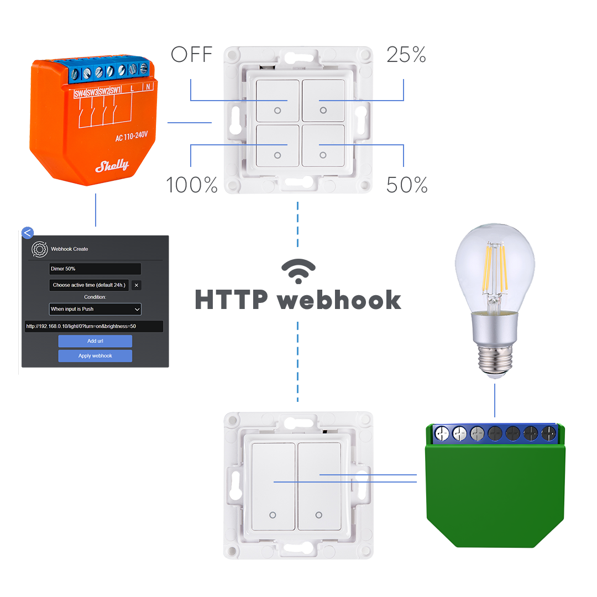

# ESPHome [](https://discord.gg/KhAMKrd) [](https://GitHub.com/esphome/esphome/releases)

[](https://esphome.io)

# esphome-configs

A collection of my personal [ESPHome](https://esphome.io) configs and packages.

## Config Groups

- [Common](#common)
- [Device Specific Config](#device-specific-config)
- [MQTT](#mqtt)
- [MQTT Automation](#mqtt-automation)
- [Sensor](#sensor)
- [Text Sensor](#text-sensor)
- [Switch](#switch)
- [Binary Sensor](#binary-sensor)

## Device Groups

Curtain Motor

- [Zemismart BCM500DS-TYW](zemismart-bcm500ds-tyw) - `Comming Soon`

Light / LED Strip

- [Athom 5W GU10](#athom-5w-gu10)
- [Iralan 42W Ceiling Light ESP32-C3](#iralan-42w-ceiling-light-esp32-c3)
- [Iralan 42W Ceiling Light ESP32-S2](#iralan-42w-ceiling-light-esp32-s2)
- [Lumary 18W Recessed Panel Light](#lumary-18w-recessed-panel-light)
- [Lusunt 36W Ceiling Light](#lusunt-36w-ceiling-light)
- [MiBoxer FUT035W](#miboxer-fut035w)
- [MiBoxer FUT039W](#miboxer-fut039w)
- [MiBoxer WB5](#miboxer-wb5)
- [OffDarks 68W Ceiling Light](#offdarks-68w-ceiling-light)
- [Offdarks 28W Ceiling Light](#offdarks-28w-ceiling-light)

Relay

- [Shelly 1](#shelly-1)
- [Shelly 2.5](#shelly-25)

Switch

- [Shelly Plus i4](#shelly-plus-i4)

# Common

[`.base-debug.yaml`](.base-debug.yaml)

This is the common config is present in all configs. It includes:

- Logger
- OTA with password
- Secret-based Wifi configuration
- Fallback AP with secret password

# Device Specific Config

`.base.devicetype-\*.yaml`

This is a device specific config that will compile correctly for the esp chip used with that device, includes the following:

- ESPHome Template, name, comment platform, board project name and version\*, any platformio options including any special platform packages and framework version and platform version
- Captive Portal
- Web Server for Web API
- Globals required by the device
- Output pins defined
- Components like Tuya, Light, WLED, E1.31
- External Components like PR for ledc when using ESP32-C3 with arduino framework
- UART pins if needed by TuyaMCU
- i2c needed by some Shelly devices
- device specific switches\*\*

\*this will vary by device and helps to show correct data in Home Assistant and ensure firmware compiles correctly. Name, Comment, Project Name and Project Version values are definable in substitutions.

\*\*be sure not to include .base.switch\*.yaml files as esphome will complain duplicate switch: has been defined.

# MQTT

[`.base.mqtt-common.yaml`](.base.mqtt-common.yaml)

This is the mqtt broker connection config is present in most configs. It includes:

- MQTT Broker Hostname/IP in `secrets.yaml`
- MQTT Username in `secrets.yaml`
- MQTT Password in `secrets.yaml`
- Discovery to allow Home Assistant to setup device\*\*\*

\*\*\*MQTT Discovery helps to ensure messages are picked up correctly but results in duplicate devices, I have kept this enabled but manually disable the device in Home Assistant cleaning up and double numbering ensuring the MQTT device has \*_2 entity id and has been disabled

# MQTT Automation

.base.mqtt-\*-automation-\*.yaml

This is a fallback mechanism in case Home Assistant becomes Offline. It mainly caters for Shelly Plus i4 and includes:

- Short Click
- Hold
- Double Click

Supports 4 buttons and multiple devices depending on .base.mqtt-\*-automation-\*.yaml file chosen

Device topics are templated in substitutions

# Sensor

[`.base.sensor-common.yaml`](.base.sensor-common.yaml)

Sensors in Home Assistant. It includes:

- WiFi Signal
- Uptime

[`.base.sensor-common-die-temp.yaml`](.base.sensor-common-die-temp.yaml)

Includes the above plus:

- ESP32 Variants CPU Temperature

# Text Sensor

[`.base.text-sensor-common.yaml`](.base.text-sensor-common.yaml)

This is the text sensor common config is present in all configs. It includes:

- IP
- SSID
- BSSID
- Human Readable Uptime

# Switch

[`.base.text-sensor-common.yaml`](.base.text-sensor-common.yaml)

This is the common switch config is present in all configs. It includes:

- Restart Switch
- Restart Switch (Safe Mode)

# Binary Sensor

[`.base.binary-sensor-common.yaml`](.base.binary-sensor-common.yaml)

This is the binary sensor common config is present in all configs. It includes:

- Status

## Setup

1. Copy the required .\*.yaml into your local ESPHome directory.
1. Open `secrets.yaml` and enter your Wifi connection info.
1. Ensure there ar no duplicate sections like double switch sections via the use of include, validate all configs before building to troubleshoot. 

# Athom 5W GU10

[`.base.bulb.athom-gu10.yaml`](.base.bulb.athom-gu10.yaml)

[](https://www.athom.tech/blank-1/esphome-gu10-rgbcw)<br />

[Athom GU10 RGBCW for ESPHome](https://www.athom.tech/blank-1/esphome-gu10-rgbcw)\
[AliExpress](https://www.aliexpress.com/item/1005003124769590.html)\
[ESPHome Devices Page](https://www.esphome-devices.com/devices/Athom-GU10-Bulb)

these bulbs come with either tasmota or esphome installed

device comes from factory setup with initial setup Captive Portal and an ESPHome adopt url setup in the default config

# Setup

the following files are required and all following substitutions should be set: - name, ssid, description, friendly name, projectname and project version
see [`bulb.ashish-spot1.yaml`](bulb.ashish-spot1.yaml) for example

[`.base-debug.yaml`](.base-debug.yaml)\
[`.base.bulb.athom-gu10.yaml`](.base.bulb.athom-gu10.yaml)\
[`.base.sensor-common.yaml`](.base.sensor-common.yaml)\
[`.base.text-sensor-common.yaml`](.base.text-sensor-common.yaml)\
[`.base.switch-common.yaml`](.base.switch-common.yaml)\
[`.base.binary-sensor-common.yaml`](.base.binary-sensor-common.yaml)

optional\
\
[`.base.mqtt-light-automation-4-button-rgbcct.yaml`](.base.mqtt-light-automation-4-button-rgbcct.yaml) - if controlled by a Shelly Plus i4

I have split the CT & RGB Channels to avoid overloading the bulb however that should not be an issue, and it is a personal preference

This device incorporates the following features in addition to MQTT, MQTT Automation, Sensors, Text Sensors, Restart Switches & Binary Status Sensor:

- ESP8285 based 2MB Flash
- Captive Portal
- Web Server
- WLED
- E1.31
- DDP

# Iralan 42W Ceiling Light ESP32-C3

[`.base.light-iralan-42w-anl400yl-esp32-c3-arduino.yaml`](.base.light-iralan-42w-anl400yl-esp32-c3-arduino.yaml)

[](https://www.shelly.cloud/shelly-plus-i4)<br />
[](https://www.shelly.cloud/shelly-plus-i4)<br />

[Iralan 42W Ceiling Light](https://www.shelly.cloud/shelly-plus-i4)\
[Shelly Store Europe](https://shop.shelly.cloud/shelly-plus-i4-wifi-smart-home-automation)\
[Shelly Store UK](https://shellystore.co.uk/product/shelly-plus-i4)\
[Amazon UK](https:/)\
[AliExpress](https://www.aliexpress.com/item/1005003774487679.html)\
[ESPHome Devices Page](https://www.esphome-devices.com/devices/Shelly-Plus-i4)

# Setup

the following files are required and all following substitutions should be set: - name, ssid, description, friendly name, projectname and project version
see [`light.bathroom.yaml`](light.bathroom.yaml) for example

[`.base-debug.yaml`](.base-debug.yaml)\
[`.base.light-iralan-42w-anl400yl-esp32-c3-arduino.yaml`](.base.light-iralan-42w-anl400yl-esp32-c3-arduino.yaml)\
[`.base.sensor-common-die-temp.yaml`](.base.sensor-common-die-temp.yaml)\
[`.base.text-sensor-common.yaml`](.base.text-sensor-common.yaml)\
[`.base.switch-common.yaml`](.base.switch-common.yaml)\
[`.base.binary-sensor-common.yaml`](.base.binary-sensor-common.yaml)

[`.base.binary-sensor-common.yaml`](.base.binary-sensor-common.yaml)

Optional\
[`.base.mqtt-light-automation-4-button-rgbcct.yaml`](.base.mqtt-light-automation-4-button-rgbcct.yaml) - if controlled by a Shelly Plus i4\

I have split the CT & RGB Channels to avoid overloading the bulb however that should not be an issue, and is a personal preference

This device incorporates the following features in addition to MQTT, MQTT Automation, Sensors, Text Sensors, Restart Switches & Binary Status Sensor:

- ESP8285 based 2MB Flash
- Captive Portal
- Web Server

# Iralan 42W Ceiling Light ESP32-S2

[`.base.light-iralan-42w-anl400yl-esp32-s2-arduino.yaml`](.base.light-iralan-42w-anl400yl-esp32-s2-arduino.yaml)

[](https://www.shelly.cloud/shelly-plus-i4)<br />
[](https://www.shelly.cloud/shelly-plus-i4)<br />

[Shelly Plus i4](https://www.shelly.cloud/shelly-plus-i4)\
[Shelly Store Europe](https://shop.shelly.cloud/shelly-plus-i4-wifi-smart-home-automation)\
[Shelly Store UK](https://shellystore.co.uk/product/shelly-plus-i4)\
[Amazon UK](https:/)\
[AliExpress](https://www.aliexpress.com/item/1005003774487679.html)\
[ESPHome Devices Page](https://www.esphome-devices.com/devices/Shelly-Plus-i4)

# Setup

the following files are required and all following substitutions should be set: - name, ssid, description, friendly name, projectname and project version
see [`light.bathroom.yaml`](light.bathroom.yaml) for example

[`.base-debug.yaml`](.base-debug.yaml)\
[`.base.light-iralan-42w-anl400yl-esp32-s2-arduino.yaml`](.base.light-iralan-42w-anl400yl-esp32-s2-arduino.yaml)\
[`.base.sensor-common-die-temp.yaml`](.base.sensor-common-die-temp.yaml)\
[`.base.text-sensor-common.yaml`](.base.text-sensor-common.yaml)\
[`.base.switch-common.yaml`](.base.switch-common.yaml)\
[`.base.binary-sensor-common.yaml`](.base.binary-sensor-common.yaml)

[`.base.binary-sensor-common.yaml`](.base.binary-sensor-common.yaml)

Optional\
[`.base.mqtt-light-automation-4-button-rgbcct.yaml`](.base.mqtt-light-automation-4-button-rgbcct.yaml) - if controlled by a Shelly Plus i4\

I have split the CT & RGB Channels to avoid overloading the bulb however that should not be an issue, and is a personal preference

This device incorporates the following features in addition to MQTT, MQTT Automation, Sensors, Text Sensors, Restart Switches & Binary Status Sensor:

- ESP8285 based 2MB Flash
- Captive Portal
- Web Server

# Lumary 18W Recessed Panel Light

[`.base.light-lumary-18w-downlight-esp32-c3-arduino.yaml`](.base.light-lumary-18w-downlight-esp32-c3-arduino.yaml)

[](https://www.shelly.cloud/shelly-plus-i4)<br />
[](https://www.shelly.cloud/shelly-plus-i4)<br />

[Lumary 18W Recessed Panel Light](https://www.shelly.cloud/shelly-plus-i4)\
[Shelly Store Europe](https://shop.shelly.cloud/shelly-plus-i4-wifi-smart-home-automation)\
[Shelly Store UK](https://shellystore.co.uk/product/shelly-plus-i4)\
[Amazon UK](https:/)\
[AliExpress](https://www.aliexpress.com/item/1005003774487679.html)\
[ESPHome Devices Page](https://www.esphome-devices.com/devices/Shelly-Plus-i4)

# Setup

the following files are required and all following substitutions should be set: - name, ssid, description, friendly name, projectname and project version
see [`light.bathroom.yaml`](light.bathroom.yaml) for example

[`.base-debug.yaml`](.base-debug.yaml)\
[`.base.light-lumary-18w-downlight-esp32-c3-arduino.yaml`](.base.light-lumary-18w-downlight-esp32-c3-arduino.yaml)\
[`.base.sensor-common-die-temp.yaml`](.base.sensor-common-die-temp.yaml)\
[`.base.text-sensor-common.yaml`](.base.text-sensor-common.yaml)\
[`.base.switch-common.yaml`](.base.switch-common.yaml)\
[`.base.binary-sensor-common.yaml`](.base.binary-sensor-common.yaml)

[`.base.binary-sensor-common.yaml`](.base.binary-sensor-common.yaml)

Optional\
[`.base.mqtt-light-automation-4-button-rgbcct.yaml`](.base.mqtt-light-automation-4-button-rgbcct.yaml) - if controlled by a Shelly Plus i4\

I have split the CT & RGB Channels to avoid overloading the bulb however that should not be an issue, and is a personal preference

This device incorporates the following features in addition to MQTT, MQTT Automation, Sensors, Text Sensors, Restart Switches & Binary Status Sensor:

- ESP8285 based 2MB Flash
- Captive Portal
- Web Server

# Lusunt 36W Ceiling Light

[`.base.light-lusunt-26w-esp12f.yaml`](.base.light-lusunt-26w-esp12f.yaml)

[](https://www.shelly.cloud/shelly-plus-i4)<br />
[](https://www.shelly.cloud/shelly-plus-i4)<br />

[Lusunt 36W Ceiling Light](https://www.shelly.cloud/shelly-plus-i4)\
[Shelly Store Europe](https://shop.shelly.cloud/shelly-plus-i4-wifi-smart-home-automation)\
[Shelly Store UK](https://shellystore.co.uk/product/shelly-plus-i4)\
[Amazon UK](https:/)\
[AliExpress](https://www.aliexpress.com/item/1005003774487679.html)\
[ESPHome Devices Page](https://www.esphome-devices.com/devices/Shelly-Plus-i4)

# Setup

the following files are required and all following substitutions should be set: - name, ssid, description, friendly name, projectname and project version
see [`light.bathroom.yaml`](light.bathroom.yaml) for example

[`.base-debug.yaml`](.base-debug.yaml)\
[`.base.light-lusunt-26w-esp12f.yaml`](.base.light-lusunt-26w-esp12f.yaml)\
[`.base.sensor-common-die-temp.yaml`](.base.sensor-common-die-temp.yaml)\
[`.base.text-sensor-common.yaml`](.base.text-sensor-common.yaml)\
[`.base.switch-common.yaml`](.base.switch-common.yaml)\
[`.base.binary-sensor-common.yaml`](.base.binary-sensor-common.yaml)

[`.base.binary-sensor-common.yaml`](.base.binary-sensor-common.yaml)

Optional\
[`.base.mqtt-light-automation-4-button-rgbcct.yaml`](.base.mqtt-light-automation-4-button-rgbcct.yaml) - if controlled by a Shelly Plus i4\

I have split the CT & RGB Channels to avoid overloading the bulb however that should not be an issue, and is a personal preference

This device incorporates the following features in addition to MQTT, MQTT Automation, Sensors, Text Sensors, Restart Switches & Binary Status Sensor:

- ESP8285 based 2MB Flash
- Captive Portal
- Web Server

# MiBoxer FUT035W

[`.base.light.miboxer-fut-035w-esp32-c3-arduino.yaml`](.base.light.miboxer-fut-035w-esp32-c3-arduino.yaml)

[](https://www.shelly.cloud/shelly-plus-i4)<br />
[](https://www.shelly.cloud/shelly-plus-i4)<br />

[MiBoxer FUT035W](https://www.shelly.cloud/shelly-plus-i4)\
[Shelly Store Europe](https://shop.shelly.cloud/shelly-plus-i4-wifi-smart-home-automation)\
[Shelly Store UK](https://shellystore.co.uk/product/shelly-plus-i4)\
[Amazon UK](https:/)\
[AliExpress](https://www.aliexpress.com/item/1005003774487679.html)\
[ESPHome Devices Page](https://www.esphome-devices.com/devices/Shelly-Plus-i4)

# Setup

the following files are required and all following substitutions should be set: - name, ssid, description, friendly name, projectname and project version
see [`light.bathroom.yaml`](light.bathroom.yaml) for example

[`.base-debug.yaml`](.base-debug.yaml)\
[`.base.light.miboxer-fut-035w-esp32-c3-arduino.yaml`](.base.light.miboxer-fut-035w-esp32-c3-arduino.yaml)\
[`.base.sensor-common-die-temp.yaml`](.base.sensor-common-die-temp.yaml)\
[`.base.text-sensor-common.yaml`](.base.text-sensor-common.yaml)\
[`.base.switch-common.yaml`](.base.switch-common.yaml)\
[`.base.binary-sensor-common.yaml`](.base.binary-sensor-common.yaml)

[`.base.binary-sensor-common.yaml`](.base.binary-sensor-common.yaml)

Optional\
[`.base.mqtt-light-automation-4-button-rgbcct.yaml`](.base.mqtt-light-automation-4-button-rgbcct.yaml) - if controlled by a Shelly Plus i4\

I have split the CT & RGB Channels to avoid overloading the bulb however that should not be an issue, and is a personal preference

This device incorporates the following features in addition to MQTT, MQTT Automation, Sensors, Text Sensors, Restart Switches & Binary Status Sensor:

- ESP8285 based 2MB Flash
- Captive Portal
- Web Server

# MiBoxer FUT039W

[`.base.light.miboxer-fut-039w-esp32-c3-arduino.yaml`](.base.light.miboxer-fut-039w-esp32-c3-arduino.yaml)

[](https://www.shelly.cloud/shelly-plus-i4)<br />
[](https://www.shelly.cloud/shelly-plus-i4)<br />

[MiBoxer FUT039W](https://www.shelly.cloud/shelly-plus-i4)\
[Shelly Store Europe](https://shop.shelly.cloud/shelly-plus-i4-wifi-smart-home-automation)\
[Shelly Store UK](https://shellystore.co.uk/product/shelly-plus-i4)\
[Amazon UK](https:/)\
[AliExpress](https://www.aliexpress.com/item/1005003774487679.html)\
[ESPHome Devices Page](https://www.esphome-devices.com/devices/Shelly-Plus-i4)

# Setup

the following files are required and all following substitutions should be set: - name, ssid, description, friendly name, projectname and project version
see [`light.bathroom.yaml`](light.bathroom.yaml) for example

[`.base-debug.yaml`](.base-debug.yaml)\
[`.base.light.miboxer-fut-039w-esp32-c3-arduino.yaml`](.base.light.miboxer-fut-039w-esp32-c3-arduino.yaml)\
[`.base.sensor-common-die-temp.yaml`](.base.sensor-common-die-temp.yaml)\
[`.base.text-sensor-common.yaml`](.base.text-sensor-common.yaml)\
[`.base.switch-common.yaml`](.base.switch-common.yaml)\
[`.base.binary-sensor-common.yaml`](.base.binary-sensor-common.yaml)

[`.base.binary-sensor-common.yaml`](.base.binary-sensor-common.yaml)

Optional\
[`.base.mqtt-light-automation-4-button-rgbcct.yaml`](.base.mqtt-light-automation-4-button-rgbcct.yaml) - if controlled by a Shelly Plus i4\

I have split the CT & RGB Channels to avoid overloading the bulb however that should not be an issue, and is a personal preference

This device incorporates the following features in addition to MQTT, MQTT Automation, Sensors, Text Sensors, Restart Switches & Binary Status Sensor:

- ESP8285 based 2MB Flash
- Captive Portal
- Web Server

# BTF-LIGHTING WB5

[`.base.light.miboxer-wb5-esp32-c3-arduino.yaml`](.base.light.miboxer-wb5-esp32-c3-arduino.yaml)

[](https://www.btf-lighting.com/products/rgbcct-controller)<br />
[](https://www.btf-lighting.com/products/rgbcct-controller)<br />
[](https://www.btf-lighting.com/products/rgbcct-controller)<br />
[](https://www.btf-lighting.com/products/rgbcct-controller)<br />
[](https://www.btf-lighting.com/products/rgbcct-controller)<br />
[](https://www.btf-lighting.com/products/rgbcct-controller)<br />
[](https://www.btf-lighting.com/products/rgbcct-controller)<br />
[](https://www.btf-lighting.com/products/rgbcct-controller)<br />
[](https://www.btf-lighting.com/products/rgbcct-controller)<br />
[](https://www.btf-lighting.com/products/rgbcct-controller)<br />
[](https://www.btf-lighting.com/products/rgbcct-controller)<br />

[BTF-LIGHTING WB5 WiFi 5 in 1 LED Strip Controller](https://www.btf-lighting.com/products/rgbcct-controller)\
[MiBoxer WL5](https://www.futlight.com/light/xqy/wl5.html)\
[Amazon UK](https:/)\
[AliExpress](https://www.aliexpress.com/item/33017144148.html)\
[Blakadder - Tasmota Supported Devices Repository](https://templates.blakadder.com/WB5.html)

This device is identical to the Miboxer WL5 (link posted above), supporting various analog PWM RGB LED strip types. The nice feature of this is chaining of controller and supports the popular Milight Remotes and Wall Remotes.

The device ships with a Tuya CB3S Module that may be possible to flash if supported by [kuba2k2 / libretuya-esphome](https://github.com/kuba2k2/libretuya-esphome). In my case I replaced the module for a [Ai-Thinker ESP-C3-12F](https://templates.blakadder.com/ESP-C3-12F.html)
initial support was poor thus I stuck to tasmota, now that platform-espressif32 version 5.2.0 and Arduino IDE version 2.0.5 is out Support is good and I know longer have issues with OTA in ESPHome with the Arduino Framework, I used to run ESPHome with ESP-IDF Framework but find the Web Server and Captive Portal useful, therefore Arduino IDE is preferred however it is not officially supported.

I had to desolder the Original CB3S, using low melt solder and a hot air station, preflashed new chip

TuyaMCU

In my setting this is used for a ceiling light that is powered by a 24V LED Strip 

# Setup

the following files are required and all following substitutions should be set: - name, ssid, description, friendly name, projectname and project version
see [`light.bathroom.yaml`](light.bathroom.yaml) for example

[`.base-debug.yaml`](.base-debug.yaml)\
[`.base.light.miboxer-wb5-esp32-c3-arduino.yaml`](.base.light.miboxer-wb5-esp32-c3-arduino.yaml)\
[`.base.sensor-common-die-temp.yaml`](.base.sensor-common-die-temp.yaml)\
[`.base.text-sensor-common.yaml`](.base.text-sensor-common.yaml)\
[`.base.switch-common.yaml`](.base.switch-common.yaml)\
[`.base.binary-sensor-common.yaml`](.base.binary-sensor-common.yaml)

[`.base.binary-sensor-common.yaml`](.base.binary-sensor-common.yaml)

Optional\
[`.base.mqtt-light-automation-4-button-rgbcct.yaml`](.base.mqtt-light-automation-4-button-rgbcct.yaml) - if controlled by a Shelly Plus i4\

I have split the CT & RGB Channels to avoid overloading the bulb however that should not be an issue, and is a personal preference

This device incorporates the following features in addition to MQTT, MQTT Automation, Sensors, Text Sensors, Restart Switches & Binary Status Sensor:

- ESP32-C3 based 4MB Flash
- Captive Portal
- Web Server

# OffDarks 68W Ceiling Light

[`.base.light.offdarks-lxd-xg68-68w-ceiling-esp32.yaml`](.base.light.offdarks-lxd-xg68-68w-ceiling-esp32.yaml)

[](https://www.aliexpress.com/item/1005001470388839.html)<br />
[](https://www.aliexpress.com/item/1005001470388839.html)<br />
[](https://www.aliexpress.com/item/1005001470388839.html)<br />
[](https://www.aliexpress.com/item/1005001470388839.html)<br />
[](https://www.aliexpress.com/item/1005001470388839.html)<br />
[](https://www.aliexpress.com/item/1005001470388839.html)<br />

[AliExpress](https://www.aliexpress.com/item/1005001470388839.html)\
[OffDarks.net - Dead Website - Wayback Machine](https://web.archive.org/web/20211220002828/http://offdarks.net)

This is an Excellent Ceiling Light Fixture, very small amount of quirks with minimal brightness setting, however it is no longer available for purchase see AliExpress Link above, however I do find the rear light useless and the RGB LED beads are not saturated enough and do not produce equivilent light to the highly unproportional amount of LED beads on the front that have amazing output.

Originally the light is sold in AliExpress as a MagicHome App Controlled Light with remote control, but what I find is the 2.4GHz RF chip and the Original ESP-M2 Module interfere alot thus I decided to hook up an [MH-ET Live ESP32 Module](https://forum.mhetlive.com/topic/8/mh-et-live-minikit-for-esp32). I had to solder to the pads of the ESP-M2 Module Footprint as I do not have the skills or the equipment to re-design the board and include the RF chip as I could not find the original from the markings printed on the chip and I am unable to remove and resolder this chip to a newly designed board without killing woring components. thus I had to make sure no contacts are shorting and I do not rip any pads off. All silicone hookup leads are 10cm long approx providing good separation between the ESP32 and the RF chip.

The board has been adapted to the following pin layout on the ESP32:

| Pin      |  LED Colour   |
|----------|:-------------:|
| GPIO5    |           Red |
| GPIO14   |         Green |
| GPIO16   |          Blue |
| GPIO17   |    Cold White |
| GPIO18   |    Warm White |

All RF Codes and functions can be found here:

[`.base.binary-sensor-offdarks-remote.yaml`](.base.binary-sensor-offdarks-remote.yaml)

# Setup

the following files are required and all following substitutions should be set: - name, ssid, description, friendly name, projectname and project version
see [`light.living.yaml`](light.living.yaml) for example

[`.base-debug.yaml`](.base-debug.yaml)\
[`.base.light.offdarks-lxd-xg68-68w-ceiling-esp32.yaml`](.base.light.offdarks-lxd-xg68-68w-ceiling-esp32.yaml)\
[`.base.global-mqtt-automation.yaml`](.base.global-mqtt-automation.yaml)\
[`.base.sensor-common.yaml`](.base.sensor-common.yaml)\
[`.base.text-sensor-common.yaml`](.base.text-sensor-common.yaml)\
[`.base.switch-common.yaml`](.base.switch-common.yaml)\
[`.base.binary-sensor-offdarks-remote.yaml`](.base.binary-sensor-offdarks-remote.yaml)

Optional\
[`.base.mqtt-light-automation-4-button-rgbcct.yaml`](.base.mqtt-light-automation-4-button-rgbcct.yaml) - if controlled by a Shelly Plus i4\

I have split the CT & RGB Channels to avoid overloading the bulb however that should not be an issue, and is a personal preference

This device incorporates the following features in addition to MQTT, MQTT Automation, Sensors, Text Sensors, Restart Switches & Binary Status Sensor:

- ESP32 based 4MB Flash
- Captive Portal
- Web Server

# Offdarks 28W Ceiling Light

[`.base.light.offdarks-lxd-xgp-28w-ceiling-wemos-d1-mini.yaml`](.base.light.offdarks-lxd-xgp-28w-ceiling-wemos-d1-mini.yaml)

[](https://www.aliexpress.com/item/1005003118910800.html)<br />
[](https://www.aliexpress.com/item/1005003118910800.html)<br />

[AliExpress](https://www.aliexpress.com/item/1005003118910800.html)\
[OffDarks.net - Dead Website - Wayback Machine](https://web.archive.org/web/20211220002828/http://offdarks.net)

This is a Spare Light not in use but pre-flashed using ESPHome ready for install if needed, Originally the light is sold in AliExpress as a MagicHome App Controlled Light with remote control, I have removed the original BL602 Module as it is incompatible with ESPHome but might gain compatability with the help of this project: [kuba2k2 / libretuya-esphome](https://github.com/kuba2k2/libretuya-esphome), a side effect was the remote control no longer works, thus the light can only be controlled via Home Assistant or a Zigbee/WiFi Button.

the BL602 module is the same footpint as a ESP-M2 Module and is pin compatible, see [PiHut - ESP8285 SMT Module - ESP8266 with 1MB FLASH (ESP-M2)](https://thepihut.com/products/esp8285-smt-module-esp8266-with-1mb-flash) due to lack of flash space I preferred to wire this up to a wemos d1 mini, by soldering directly on to the pads with the correct guage wire 28 guage should do the trick, I had to be careful I do not rip any pads and no neighbouring pads are shorting.

uses the following pin layout:

| Pin      |  LED Colour   |
|----------|:-------------:|
| GPIO4    |           Red |
| GPIO5    |    Cold White |
| GPIO12   |         Green |
| GPIO13   |    Warm White |
| GPIO14   |          Blue |

# Setup

the following files are required and all following substitutions should be set: - name, ssid, description, friendly name, projectname and project version
see [`.light.spare-28w-rgbcct.yaml`](.light.spare-28w-rgbcct.yaml) for example

[`.base-debug.yaml`](.base-debug.yaml)\
[`.base.light.offdarks-lxd-xgp-28w-ceiling-wemos-d1-mini.yaml`](.base.light.offdarks-lxd-xgp-28w-ceiling-wemos-d1-mini.yaml)\
[`.base.global-mqtt-automation.yaml`](.base.global-mqtt-automation.yaml)\
[`.base.sensor-common.yaml`](.base.sensor-common.yaml)\
[`.base.text-sensor-common.yaml`](.base.text-sensor-common.yaml)\
[`.base.switch-common.yaml`](.base.switch-common.yaml)\
[`.base.binary-sensor-common.yaml`](.base.binary-sensor-common.yaml)

Optional\
[`.base.mqtt-light-automation-1-button.yaml`](.base.mqtt-light-automation-1-button.yaml) - if controlled by a Zigbee or WiFi Button Controller\

I have split the CT & RGB Channels to avoid overloading the bulb however that should not be an issue, and is a personal preference

This device incorporates the following features in addition to MQTT, MQTT Automation, Sensors, Text Sensors, Restart Switches & Binary Status Sensor:

- ESP8266 based 4MB Flash
- Captive Portal
- Web Server

# Shelly 1

[`.base.relay.shelly-1-generic.yaml`](.base.relay.shelly-2.5-generic.yaml)

[](https://www.shelly.cloud/products/shelly-1-smart-home-automation-relay)<br />

[Shelly 1](https://www.shelly.cloud/products/shelly-1-smart-home-automation-relay)\
[Shelly Store Europe](https://shop.shelly.cloud/shelly-1-wifi-smart-home-automation)\
[Shelly Store UK](https://shellystore.co.uk/product/shelly-plus-i4/https://shellystore.co.uk/product/shelly-1)\
[Amazon UK](https://www.amazon.co.uk/Shelly-Automation-Wi-Fi-Compatible-Google/dp/B082626S4S)\
[AliExpress](https://www.aliexpress.com/item/1005002716450669.html)\
[ESPHome Devices Page](https://www.esphome-devices.com/devices/Shelly-1)

Shelly 1 is a Relay small enough to fit inside in terms of UK electrical standard, an adapted/modified Ceiling rose or behind a wall switch, I have mine in the ceiling next to light connector, easy retro-fitting and reversal if needed.

Mine are using in Bath area where we have pull cords, it does not make sense replacing the pull cords for monetary ones which are normally used in UK hospitals and Care Homes for elderly an are more harder to get hold of, with the shelly you can keep all existing analog switches and make them connected, non the wiser no one can guess the system is connected, unless they use their handheld wifi scanners. see [`relay.bath-entrance.yaml`](relay.bath-entrance.yaml) or see [`relay.bathroom-wall.yaml`](relay.bathroom-wall.yaml) for example

for convenience I am not including wiring details these can be found at: [Knowledge Base - Shelly 1](https://www.shelly.cloud/knowledge-base/devices/shelly-1)

Note on flashing, safest way to flash any shelly device is via serial port but this requires a USB to TTL converter with the correct pitch pin conncetors for the shelly headers.

However I was able to flash from stock to ESPHome via OTA using this amazing project: [Mongoose to Tasmota, Home Accessory Architect or ESPurna](https://github.com/yaourdt/mgos-to-tasmota)

use the following URL to flash your shelly:

[`http://shellyip/ota?url=http://dl.dasker.eu/firmware/mg2tasmota-Shelly1.zip`](http://shellyip/ota?url=http://dl.dasker.eu/firmware/mg2tasmota-Shelly1.zip)

Further instructions can be found on the link to the github page of the project.

# Setup

the following files are required and all following substitutions should be set: - name, ssid, description, friendly name, projectname and project version
see [`relay.bath-entrance.yaml`](relay.bath-entrance.yaml) for example

[`.base-debug.yaml`](.base-debug.yaml)\
[`.base.relay.shelly-1-generic`](.base.relay.shelly-1-generic)\
[`.base.mqtt-light-automation-1-lonsonho.yaml`](.base.mqtt-light-automation-1-lonsonho.yaml) - if controlled by a Zigbee Button\
[`.base.sensor-common.yaml`](.base.sensor-common.yaml)\
[`.base.text-sensor-common.yaml`](.base.text-sensor-common.yaml)\
[`.base.switch-shelly-1-generic.yaml`](.base.switch-shelly-1-generic.yaml)\
[`.base.binary-sensor-common.yaml`](.base.binary-sensor-common.yaml)

This device incorporates the following features in addition to MQTT Automation, Sensors, Text Sensors, Restart Switches & Binary Status Sensor:

- ESP8285 based 2MB Flash
- Captive Portal
- Web Server

# Shelly 2.5

[`.base.relay.shelly-2.5-generic.yaml`](.base.relay.shelly-2.5-generic.yaml)

[](https://www.shelly.cloud/products/shelly-25-smart-home-automation-relay)<br />
[](https://www.shelly.cloud/products/shelly-25-smart-home-automation-relay)<br />
[](https://www.shelly.cloud/products/shelly-25-smart-home-automation-relay)<br />

[Shelly 2.5](https://www.shelly.cloud/products/shelly-25-smart-home-automation-relay)\
[Shelly Store Europe](https://shop.shelly.cloud/shelly-2.5-ce-ul-wifi-smart-home-automation)\
[Shelly Store UK](https://shellystore.co.uk/product/shelly-25)\
[Amazon UK](https://www.amazon.co.uk/Shelly-Controlling-Electrical-Circuits-Compatible/dp/B07Q9M2Y1S)\
[AliExpress](https://www.aliexpress.com/item/1005002789235469.html)\
[ESPHome Devices Page](https://www.esphome-devices.com/devices/Shelly-25)

Shelly 2.5 is a Relay small enough to fit inside in terms of UK electrical standard, an adapted/modified Ceiling rose or behind a wall switch, I have mine in the ceiling next to light connector, easy retro-fitting and reversal if needed. Over the Shelly 1 added benefits include, two relays in one board and supports two switches and some neat power monitoring.

Mine are used in Bath area where we have pull cords and two device controlled by a single switch. see [`relay.bathroom.yaml`](relay.bathroom.yaml) for example, I have defined the main switch as a binary light and the second one as a binary fan, light is linked to pull cord and fan is controlled via automation and a zigbee button.

for convenience I am not including wiring details these can be found at: [Knowledge Base - Shelly 2.5](https://www.shelly.cloud/knowledge-base/devices/shelly-25)

Note on flashing, safest way to flash any shelly device is via serial port but this requires a USB to TTL converter with the correct pitch pin conncetors for the shelly headers.

However I was able to flash from stock to ESPHome via OTA using this amazing project: [Mongoose to Tasmota, Home Accessory Architect or ESPurna](https://github.com/yaourdt/mgos-to-tasmota)

use the following URL to flash your shelly:

[`http://shellyip/ota?url=http://dl.dasker.eu/firmware/mg2tasmota-Shelly25.zip`](http://shellyip/ota?url=http://dl.dasker.eu/firmware/mg2tasmota-Shelly25.zip)

Further instructions can be found on the link to the github page of the project.

# Setup

the following files are required and all following substitutions should be set: - name, ssid, description, friendly name, projectname and project version
see [`relay.bathroom.yaml`](relay.bathroom.yaml) for example

[`.base-debug.yaml`](.base-debug.yaml)\
[`.base.relay.shelly-2.5-generic.yaml`](.base.relay.shelly-2.5-generic.yaml)\
[`.base.mqtt-light-automation-4-button-rgbcct.yaml`](.base.mqtt-light-automation-2-lonsonho.yaml) - if controlled by a Zigbee Button\
[`.base.sensor-common-die-temp.yaml`](.base.sensor-common.yaml)\
[`.base.text-sensor-common.yaml`](.base.text-sensor-common.yaml)\
[`.base.switch-shelly-2.5-generic.yaml`](.base.switch-shelly-2.5-generic.yaml)\
[`.base.binary-sensor-common.yaml`](.base.binary-sensor-common.yaml)

This device incorporates the following features in addition to MQTT, MQTT Automation, Sensors, Text Sensors, Restart Switches & Binary Status Sensor:

- ESP8285 based 2MB Flash
- Captive Portal
- Web Server

# Shelly Plus i4

[`.base.switch.shelly-plus-i4-arduino.yaml`](.base.switch.shelly-plus-i4-arduino.yaml)

[](https://www.shelly.cloud/shelly-plus-i4)<br />
[](https://www.shelly.cloud/shelly-plus-i4)<br />

[Shelly Plus i4](https://www.shelly.cloud/shelly-plus-i4)\
[Shelly Store Europe](https://shop.shelly.cloud/shelly-plus-i4-wifi-smart-home-automation)\
[Shelly Store UK](https://shellystore.co.uk/product/shelly-plus-i4)\
[Amazon UK](https://www.amazon.co.uk/Shelly-Bluetooth-monitor-compatible-Assistant/dp/B09SWYGBZK)\
[AliExpress](https://www.aliexpress.com/item/1005003774487679.html)\
[ESPHome Devices Page](https://www.esphome-devices.com/devices/Shelly-Plus-i4)

Shelly Plus i4 is a Wall Mounted Controller/Assignable buttons powered by mains.

In my configuration I'm using the Arduino Framework which is not the recommended framework for new ESP32 variants, however Core Legacy Non-Ported ESPHome Componenents are more abundant than the newer ported ones, i.e the Web Server and Captive Portal are yet to be ported over to ESP-IDF, thus I prefer to use Arduino Framework.

I achieve Arduino compatibility using the below, as the chip used is basically a Single Core Regular ESP32 with a disabled core. We have to use a version of the espressif platform for Arduino IDE with the correct sdkconfig `#define CONFIG_FREERTOS_UNICORE 1` which is an essential macro used in many places in the Arduino Core

Thanks to the contributors at @ [arendst / Tasmota](https://github.com/arendst/Tasmota) specifically [Jason2866 / platform-espressif32](https://github.com/Jason2866/platform-espressif32) who kindly provides releases of the Arduino IDE platform-espressif32 [framework-arduinoespressif32-solo1 2.0.5](https://github.com/tasmota/arduino-esp32/releases/download/2.0.5/framework-arduinoespressif32-solo1.zip) that support ESP32-U4WDH I am able to compile ESPHOME for the Shelly Plus i4.

see [`.base.switch.shelly-plus-i4-arduino.yaml`](.base.switch.shelly-plus-i4-arduino.yaml) for reference

```yaml
  esphome:
    name: ${device_name}
    comment: ${device_description}
    platformio_options:
      platform_packages:
      - framework-arduinoespressif32 @ https://github.com/tasmota/arduino-esp32/releases/download/2.0.5/framework-arduinoespressif32-solo1.zip
      board_build.f_cpu: 160000000L
    project:
      name: "${project_name}"
      version: "${project_version}"
  
  esp32:
    board: esp32doit-devkit-v1
    variant: esp32
    framework:
      type: arduino
      platform_version: 5.2.0
```

My Config Offers regular Home Assistant API connectivity as well as mqtt and http**** fallback, each button has three functions:

- Short Click
- Double Click
- Hold

****provided a password for the web server has not been enabled

Note on flashing, safest way to flash any shelly device is via serial port but this requires a USB to TTL converter with the correct pitch pin connectors for the shelly headers. I have managed to flash my Shelly Plus i4 using a special USB TTL Adaptor by [VoltLink CP2102N USB Serial Adapter & Programmer](https://www.tindie.com/products/voltlog/voltlink-cp2102n-usb-serial-adapter-programmer).

With the Shelly i4 it's not possible to flash from Stock to ESPHome via OTA as I have not seen support from [mgos-to-tasmota](https://github.com/yaourdt/mgos-to-tasmota), despite the chip being a esp32-solo, which is well supported from the arduino side.

# Setup

the following files are required and all following substitutions should be set: - name, ssid, description, friendly name, projectname and project version
see [`switch.dining.yaml`](switch.dining.yaml) for example

[`.base-debug.yaml`](.base-debug.yaml)\
[`.base.switch.shelly-plus-i4-arduino.yaml`](.base.switch.shelly-plus-i4-arduino.yaml)\
[`.base.mqtt-common.yaml`](.base.mqtt-common.yaml)\
[`.base.sensor-common-die-temp.yaml`](.base.sensor-common-die-temp.yaml)\
[`.base.text-sensor-common.yaml`](.base.text-sensor-common.yaml)\
[`.base.switch-common.yaml`](.base.switch-common.yaml)\
[`.base.binary-sensor-shelly-i4-4-buttons-fallback.yaml`](.base.binary-sensor-shelly-i4-4-buttons-fallback.yaml)

This device incorporates the following features in addition to MQTT, MQTT Automation, Sensors, Text Sensors, Restart Switches & Binary Status Sensor:

- ESP32-U4WDH based 4MB Flash
- Captive Portal
- Web Server

The Binary Sensors File is where the magic happens for this device all the key button code resides here including the fallback settings:
[`.base.binary-sensor-shelly-i4-4-buttons-fallback.yaml`](.base.binary-sensor-shelly-i4-4-buttons-fallback.yaml)